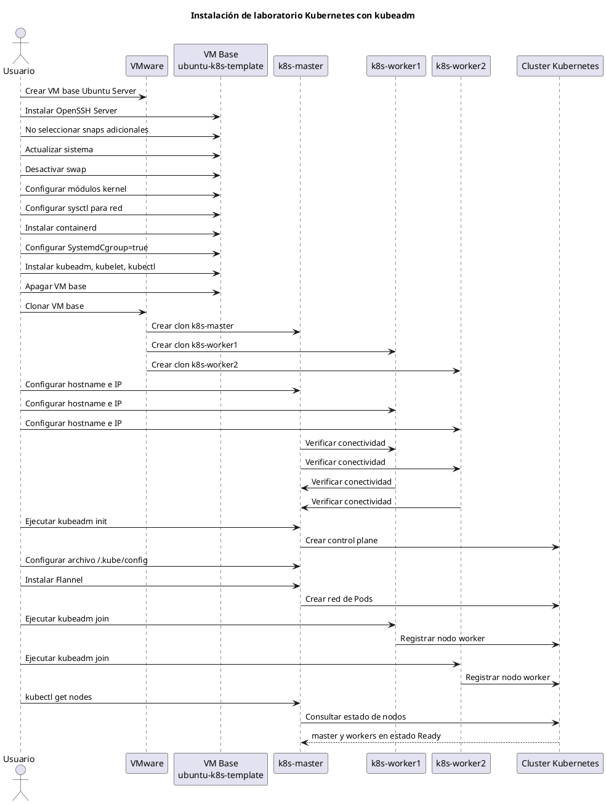

# Laboratorio Kubernetes con kubeadm sobre VMware

Este README documenta la instalación de un laboratorio Kubernetes compuesto por tres máquinas virtuales Linux sobre VMware.

## 1. Objetivo del laboratorio

Construir un cluster Kubernetes básico usando:

- 1 nodo control plane: `k8s-master`
- 2 nodos worker: `k8s-worker1` y `k8s-worker2`
- Ubuntu Server 24.04 LTS
- containerd como Container Runtime
- kubeadm para inicializar el cluster
- kubelet como agente de nodo
- kubectl como cliente de administración
- Flannel como red de Pods

## 2. Requerimientos por máquina virtual

Cada máquina virtual debe tener, como mínimo:

| Recurso | Valor |
|---|---:|
| RAM | 2 GB |
| CPU | 2 vCPU |
| Disco | 25 GB o más |
| Sistema operativo | Ubuntu Server 24.04 LTS |
| Red | Comunicación entre todos los nodos |

Ejemplo de nodos:

| Nodo | Rol | IP de ejemplo |
|---|---|---|
| `k8s-master` | Control plane | `192.168.56.10` |
| `k8s-worker1` | Worker | `192.168.56.11` |
| `k8s-worker2` | Worker | `192.168.56.12` |

> Ajustar las IP según la red usada en VMware.

---

## 3. Estrategia recomendada

La forma más eficiente es crear una VM base llamada:

```text
ubuntu-k8s-template
```

En esa VM base se instalan las herramientas comunes. Luego se clona tres veces.

No se debe ejecutar `kubeadm init` ni `kubeadm join` antes de clonar, porque esos comandos generan certificados, tokens e identidad propia del nodo.

---

# 4. Instalación de Ubuntu Server

Durante la instalación de Ubuntu Server:

1. Seleccionar Ubuntu Server, no Ubuntu Desktop.
2. Activar OpenSSH Server.
3. No seleccionar snaps adicionales en la pantalla "Featured Server Snaps".
4. No instalar MicroK8s, porque este laboratorio usa kubeadm.

---

# 5. Preparación de la VM base

Ejecutar los siguientes comandos en la VM `ubuntu-k8s-template`.

## 5.1 Actualizar sistema e instalar herramientas básicas

```bash
sudo apt update
```

Actualiza la lista local de paquetes disponibles desde los repositorios configurados.

```bash
sudo apt upgrade -y
```

Actualiza los paquetes instalados en el sistema. La opción `-y` acepta automáticamente la instalación.

```bash
sudo apt install -y curl wget vim net-tools openssh-server ca-certificates gnupg lsb-release apt-transport-https
```

Instala herramientas necesarias para administración, descarga de archivos, manejo de certificados y conexión SSH.

Descripción general:

| Paquete | Uso |
|---|---|
| `curl` | Descargar contenido desde URLs |
| `wget` | Descargar archivos desde internet |
| `vim` | Editor de texto en consola |
| `net-tools` | Herramientas como `ifconfig` y `netstat` |
| `openssh-server` | Permite conectarse por SSH |
| `ca-certificates` | Certificados raíz para conexiones HTTPS |
| `gnupg` | Manejo de llaves GPG |
| `lsb-release` | Información de la distribución Linux |
| `apt-transport-https` | Soporte HTTPS para repositorios APT |

---

## 5.2 Desactivar swap

Kubernetes requiere que swap esté desactivado para evitar problemas de planificación y administración de recursos.

```bash
sudo swapoff -a
```

Desactiva swap inmediatamente en la sesión actual.

```bash
sudo sed -i '/\/swap.img/s/^/#/' /etc/fstab
```

Revisa que este desactivado
```bash
swapon --show
```

Comenta la línea de swap en `/etc/fstab` para que no vuelva a activarse después de reiniciar.

---

## 5.3 Cargar módulos del kernel requeridos

```bash
cat <<EOF | sudo tee /etc/modules-load.d/k8s.conf
overlay
br_netfilter
EOF
```

Crea un archivo para cargar automáticamente los módulos `overlay` y `br_netfilter` al iniciar el sistema.

| Módulo | Función |
|---|---|
| `overlay` | Usado por containerd para el almacenamiento de capas de contenedores |
| `br_netfilter` | Permite que iptables procese tráfico que pasa por bridges Linux |

```bash
sudo modprobe overlay
```

Carga inmediatamente el módulo `overlay`.

```bash
sudo modprobe br_netfilter
```

Carga inmediatamente el módulo `br_netfilter`.

---

## 5.4 Configurar parámetros de red para Kubernetes

```bash
cat <<EOF | sudo tee /etc/sysctl.d/k8s.conf
net.bridge.bridge-nf-call-iptables=1
net.bridge.bridge-nf-call-ip6tables=1
net.ipv4.ip_forward=1
EOF
```

Crea un archivo de configuración de red requerido por Kubernetes.

| Parámetro | Función |
|---|---|
| `net.bridge.bridge-nf-call-iptables=1` | Permite aplicar reglas iptables al tráfico IPv4 que pasa por bridges |
| `net.bridge.bridge-nf-call-ip6tables=1` | Permite aplicar reglas iptables al tráfico IPv6 que pasa por bridges |
| `net.ipv4.ip_forward=1` | Permite reenviar paquetes IPv4 entre interfaces |

```bash
sudo sysctl --system
```

Aplica los parámetros configurados en los archivos de `sysctl`.

---

# 6. Instalación de containerd

```bash
sudo apt install -y containerd
```

Instala containerd, que será el Container Runtime usado por Kubernetes.

```bash
sudo mkdir -p /etc/containerd
```

Crea el directorio de configuración de containerd si no existe.

```bash
containerd config default | sudo tee /etc/containerd/config.toml > /dev/null
```

Genera la configuración por defecto de containerd y la guarda en `/etc/containerd/config.toml`.

```bash
sudo sed -i 's/SystemdCgroup = false/SystemdCgroup = true/' /etc/containerd/config.toml
```

Configura containerd para usar `systemd` como cgroup driver.

Esto es importante porque kubelet también usa `systemd` como cgroup driver en instalaciones modernas con kubeadm.

```bash
sudo systemctl restart containerd
```

Reinicia containerd para aplicar la configuración.

```bash
sudo systemctl enable containerd
```

Habilita containerd para que se inicie automáticamente al arrancar la máquina.

```bash
sudo systemctl status containerd
```

Permite verificar que containerd está activo.

---

# 7. Instalación de kubeadm, kubelet y kubectl

> En este ejemplo se usa Kubernetes `v1.34`. Si el curso exige otra versión, se debe cambiar `v1.34` por la versión correspondiente.

```bash
sudo mkdir -p /etc/apt/keyrings
```

Crea el directorio donde se almacenará la llave GPG del repositorio de Kubernetes.

```bash
curl -fsSL https://pkgs.k8s.io/core:/stable:/v1.34/deb/Release.key \
  | sudo gpg --dearmor -o /etc/apt/keyrings/kubernetes-apt-keyring.gpg
```

Descarga la llave pública del repositorio oficial de paquetes Kubernetes y la guarda en formato compatible con APT.

```bash
echo 'deb [signed-by=/etc/apt/keyrings/kubernetes-apt-keyring.gpg] https://pkgs.k8s.io/core:/stable:/v1.34/deb/ /' \
  | sudo tee /etc/apt/sources.list.d/kubernetes.list
```

Agrega el repositorio de Kubernetes a la configuración de APT.

```bash
sudo apt update
```

Actualiza la lista de paquetes, incluyendo ahora los paquetes del repositorio de Kubernetes.

```bash
sudo apt install -y kubelet kubeadm kubectl cri-tools
```

Instala los componentes principales de Kubernetes.

| Componente | Función |
|---|---|
| `kubeadm` | Inicializa el cluster y une nodos |
| `kubelet` | Agente que corre en cada nodo |
| `kubectl` | Cliente de línea de comandos para administrar Kubernetes |

```bash
sudo apt-mark hold kubelet kubeadm kubectl
```

Bloquea la versión instalada para evitar actualizaciones automáticas no controladas.

---

# 8. Apagar la VM base y clonar

```bash
sudo shutdown now
```

Apaga la VM base para crear clones consistentes.

Crear tres clones en VMware:

```text
k8s-master
k8s-worker1
k8s-worker2
```

Se recomienda usar `Full Clone` para evitar dependencia de la VM base.

---

# 9. Configuración posterior al clonado

Estos pasos se ejecutan después de clonar.

## 9.1 Cambiar hostname

En el nodo master:

```bash
sudo hostnamectl set-hostname k8s-master
```

Asigna el nombre `k8s-master` al nodo control plane.

En el primer worker:

```bash
sudo hostnamectl set-hostname k8s-worker1
```

Asigna el nombre `k8s-worker1`.

En el segundo worker:

```bash
sudo hostnamectl set-hostname k8s-worker2
```

Asigna el nombre `k8s-worker2`.

---

## 9.2 Configurar resolución local de nombres

Editar `/etc/hosts` en las tres máquinas:

```bash
sudo nano /etc/hosts
```

Agregar las IP y nombres de los nodos:

```text
192.168.56.10 k8s-master
192.168.56.11 k8s-worker1
192.168.56.12 k8s-worker2
```

Esto permite que los nodos se resuelvan entre sí por nombre.

---

## 9.3 Verificar conectividad entre nodos

Desde cada máquina probar comunicación:

```bash
ping k8s-master
```

Verifica conectividad hacia el nodo master.

```bash
ping k8s-worker1
```

Verifica conectividad hacia el worker 1.

```bash
ping k8s-worker2
```

Verifica conectividad hacia el worker 2.

---

# 10. Inicializar el cluster

Este paso se ejecuta solo en `k8s-master`.

```bash
sudo kubeadm init --pod-network-cidr=10.244.0.0/16
```

Inicializa el cluster Kubernetes.

El parámetro `--pod-network-cidr=10.244.0.0/16` define el rango de red interno que usarán los Pods. Este rango es compatible con Flannel.

---

# 11. Configurar kubectl en el nodo master

Después de ejecutar `kubeadm init`, configurar el acceso local a Kubernetes:

```bash
mkdir -p $HOME/.kube
```

Crea el directorio donde se guardará la configuración de `kubectl`.

```bash
sudo cp /etc/kubernetes/admin.conf $HOME/.kube/config
```

Copia el archivo de configuración administrativa del cluster.

```bash
sudo chown $(id -u):$(id -g) $HOME/.kube/config
```

Cambia el dueño del archivo para que el usuario actual pueda usar `kubectl` sin `sudo`.

Verificar:

```bash
kubectl get nodes
```

Lista los nodos registrados en el cluster.

---

# 12. Instalar Flannel

Inicialmente se puede intentar usar la URL de releases:

```bash
kubectl apply -f https://github.com/flannel-io/flannel/releases/latest/download/kube-flannel.yml
```

Si esa URL no funciona, usar la siguiente URL alternativa desde el repositorio:

```bash
kubectl apply -f https://raw.githubusercontent.com/flannel-io/flannel/master/Documentation/kube-flannel.yml
```

Este comando instala Flannel, que provee la red interna para que los Pods puedan comunicarse entre nodos.

---

# 13. Unir los workers al cluster

Al finalizar `kubeadm init`, Kubernetes muestra un comando parecido a este:

```bash
sudo kubeadm join 192.168.56.10:6443 --token <TOKEN> \
  --discovery-token-ca-cert-hash sha256:<HASH>
```

Para recrear el token usar el comando
```bash
kubeadm token create --print-join-command
```

Ejecutar ese comando en cada worker:

- `k8s-worker1`
- `k8s-worker2`

El comando registra cada worker en el cluster.

---

# 14. Verificación final

En `k8s-master` ejecutar:

```bash
kubectl get nodes
```

Muestra el estado de los nodos.

Resultado esperado:

```text
NAME          STATUS   ROLES           AGE   VERSION
k8s-master    Ready    control-plane    ...   ...
k8s-worker1   Ready    <none>           ...   ...
k8s-worker2   Ready    <none>           ...   ...
```

Verificar Pods del sistema:

```bash
kubectl get pods -A
```

Lista todos los Pods en todos los namespaces.

Los Pods principales de Kubernetes y Flannel deben quedar en estado `Running`.

---

# 15. Diagrama de secuencia

El siguiente diagrama está en formato PlantUML y puede ser usado en PlantText.


Fuente PlantUML:



---

# 16. Comandos útiles posteriores

Ver nodos:

```bash
kubectl get nodes -o wide
```

Ver Pods de todos los namespaces:

```bash
kubectl get pods -A
```

Ver información del cluster:

```bash
kubectl cluster-info
```

Ver eventos recientes:

```bash
kubectl get events -A --sort-by=.metadata.creationTimestamp
```

Ver configuración de containerd:

```bash
sudo systemctl status containerd
```

Ver estado de kubelet:

```bash
sudo systemctl status kubelet
```

Ver logs de kubelet:

```bash
journalctl -u kubelet -f
```

---

# 17. Notas importantes

- No instalar MicroK8s si el objetivo es practicar kubeadm.
- No ejecutar `kubeadm init` antes de clonar.
- No ejecutar `kubeadm join` en la VM base.
- Usar Ubuntu Server para reducir consumo de RAM.
- Desactivar swap antes de inicializar Kubernetes.
- Verificar conectividad entre nodos antes de ejecutar `kubeadm init`.
- Instalar una red de Pods, como Flannel, antes de esperar que todos los nodos queden en estado `Ready`.

# 18. Ejemplos de deployments

```bash
kubectl create deployment apache1 --replicas=3 --image=httpd
kubectl get pod -o wide
kubectl scale deployment apache1 --replicas=4
kubectl get pod -o wide
```

kubectl get pod -o wide

