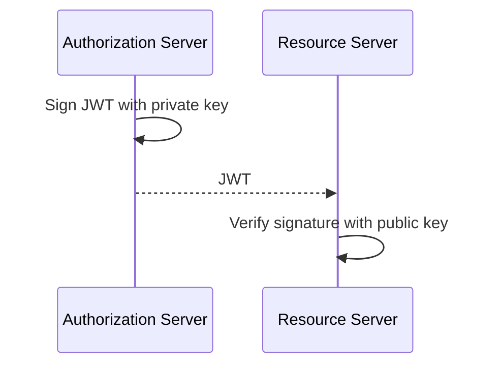

# JWT — JSON Web Token

## Why does it exist?

Backend systems frequently need to transport a set of claims between parties in a compact form whose integrity can be verified. A JSON Web Token (JWT) is a token format for representing those claims.
JWT is **not OAuth 2.0**. OAuth 2.0 may use JWTs as access tokens, but OAuth does not require JWT and JWT has uses outside OAuth.

## Structure

A commonly encountered signed JWT has three Base64URL-encoded parts:

```text
HEADER.PAYLOAD.SIGNATURE
```

### Header

Contains metadata about the token and its cryptographic processing.

```json
{
  "alg": "RS256",
  "typ": "JWT",
  "kid": "key-2026-01"
}
```

`kid` identifies a key that the verifier can select. It is not itself a public key and does not establish trust.

### Payload

Contains claims.

```json
{
  "sub": "billing-service",
  "aud": "contracts-api",
  "scope": "contracts.read",
  "iss": "https://auth.example",
  "exp": 1790870400
}
```

A useful first mental model is:

- `sub` — who the subject is.
- `scope` — what access has been granted.
- `aud` — where the token is intended to be accepted.
- `iss` — who issued the token.
- `exp` — when the token expires.

The exact semantics and claims used depend on the protocol and system.

## Signature and asymmetric cryptography

With an asymmetric signing algorithm, the issuer signs using its private key and Resource Servers verify using the corresponding public key.



If an attacker modifies the payload but cannot create a valid new signature, signature verification fails.

Multiple Resource Servers can possess the public key without gaining the ability to sign new tokens with the issuer's private key.

## Signed does not mean encrypted

The header and payload of a typical signed JWT can be decoded. Base64URL is an encoding, not encryption.

Therefore:

```text
decode JWT != validate JWT
```

Sensitive information should not be assumed confidential merely because it is inside a signed JWT.

## Validation

A Resource Server should not trust a token merely because it can decode it. Relevant validation commonly includes:

1. Verify the cryptographic signature using a trusted key.
2. Verify the expected issuer (`iss`).
3. Verify that the Resource Server is an intended audience (`aud`).
4. Verify temporal validity, including expiration (`exp`).
5. Apply the authorization requirements for the requested operation, such as
   scopes or policies.

A token with a valid signature but an audience for another API must not be accepted merely because its signature is valid.

## Public-key discovery and `kid`

Authorization Servers can expose public verification keys through a JSON Web Key Set (JWKS). A Resource Server can use the JWT header's `kid` to select the appropriate verification key.

Conceptually:

```text
JWT arrives
    |
    v
read kid
    |
    v
select trusted public key
    |
    v
verify signature
```

Key discovery and caching are operational concerns that should not be confused with the fundamental trust decision: the Resource Server must validate tokens against keys obtained from a trusted issuer configuration.

## JWT and revocation

Self-contained JWT access tokens can often be validated locally. This reduces the need for a synchronous call to the Authorization Server on every API request.

The trade-off is that immediate revocation is harder: a previously issued token can remain cryptographically valid until its validity period ends unless the architecture introduces additional revocation/state mechanisms.

This is one reason access-token lifetime is an important security and operational decision.

## Common misconceptions

### "JWT means OAuth"

No. JWT is a token format; OAuth 2.0 is an authorization framework.

### "If I can decode it, it is valid"

No. Decoding only exposes the encoded data. Trust requires validation.

### "Signed means encrypted"

No. A signature protects integrity/authenticity; it does not provide confidentiality.

### "`kid` proves which key is trusted"

No. `kid` helps select a key. Trust comes from the issuer configuration and the trusted key-distribution mechanism.

## Relationship with OAuth 2.0

OAuth 2.0 access tokens may be JWTs. When they are, the Resource Server can use the JWT claims and signature as part of token validation.

Continue with [OAuth 2.0 & OpenID Connect](007-OAuth2.md).

## Summary

- JWT is a token format.
- A signed JWT commonly consists of header, payload, and signature.
- The payload contains claims; it is not inherently confidential.
- Asymmetric signing lets an issuer sign with a private key and APIs verify with   a public key.
- Decoding is not validation.
- Signature, issuer, audience and expiration are distinct validation concerns.
- JWT and OAuth 2.0 solve different problems.

## References

- RFC 7519 — JSON Web Token (JWT)
- RFC 7515 — JSON Web Signature (JWS)
- RFC 7517 — JSON Web Key (JWK)
