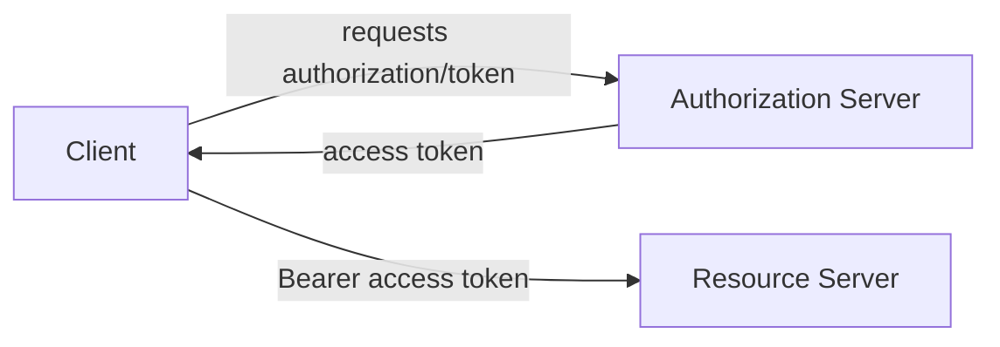
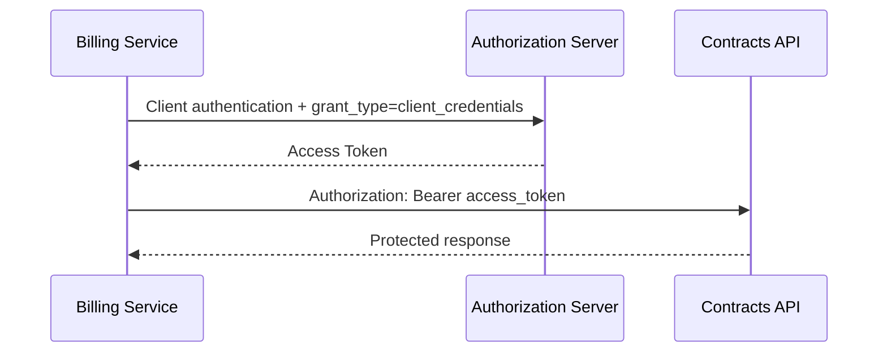
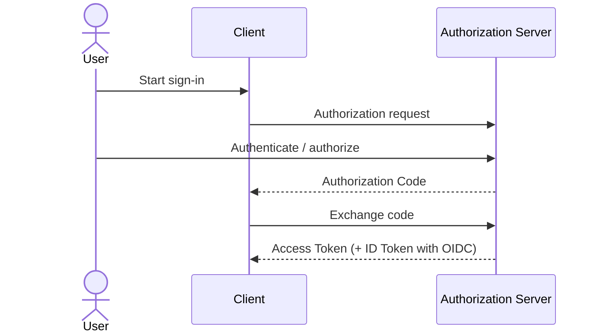
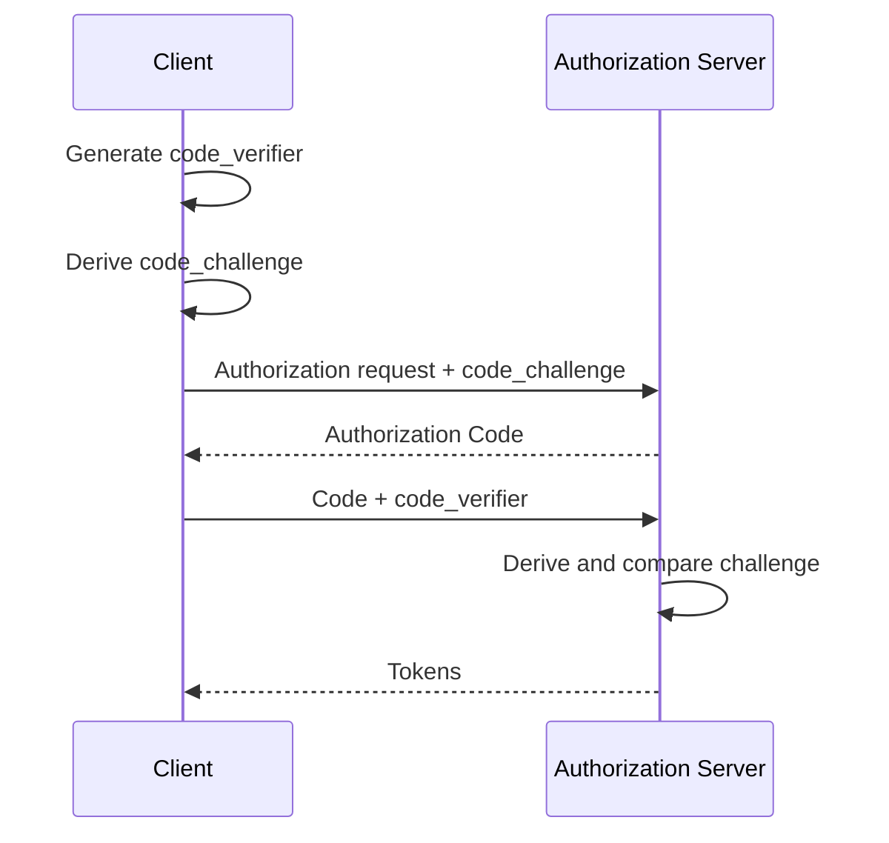
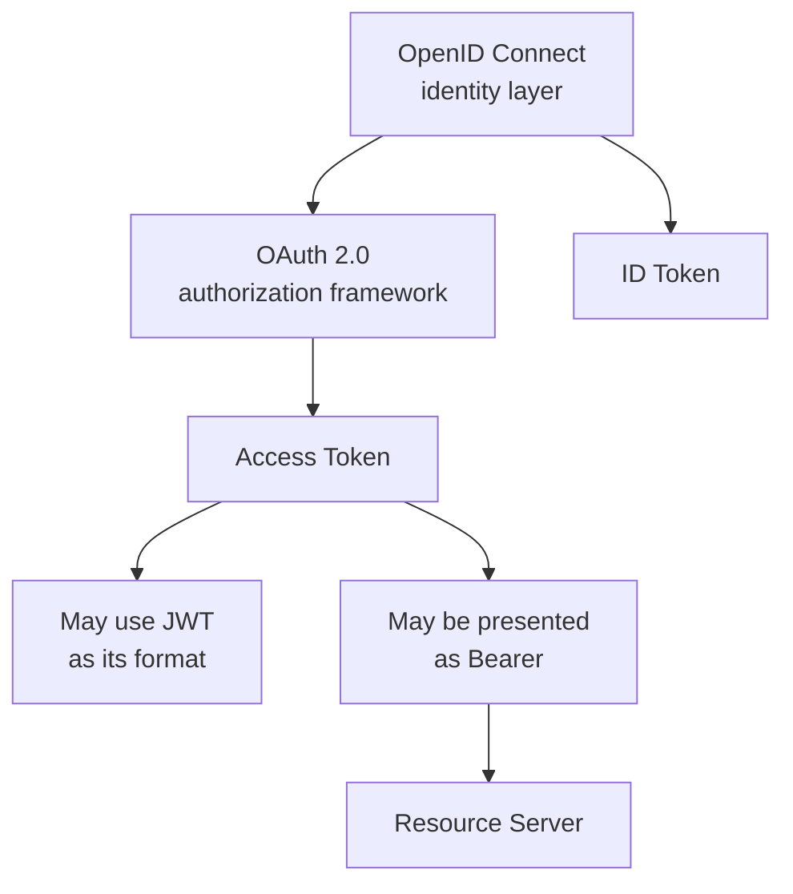

# OAuth 2.0 & OpenID Connect

## Why does OAuth 2.0 exist?

A client application often needs limited access to a protected resource without treating the user's or application's primary credentials as the credential for every protected API call.

OAuth 2.0 is an **authorization framework**. Its objective is about delegated or client access to protected resources, not about defining a JWT format.

## Authentication vs authorization

```text
Authentication -> Who are you?
Authorization  -> What are you allowed to do?
```

OAuth 2.0 primarily addresses authorization. OpenID Connect (OIDC) adds an identity/authentication layer on top of OAuth 2.0.

## OAuth roles

The core model involves:

- **Resource Owner** — entity capable of granting access to a protected resource.
- **Client** — application requesting access.
- **Authorization Server** — issues access tokens after the applicable flow.
- **Resource Server** — API hosting protected resources and accepting appropriate access tokens.



## Access Token

An Access Token is a credential representing granted access. The client presents it to the Resource Server.

```http
GET /contracts
Authorization: Bearer <access_token>
```

An Access Token may be a JWT, but OAuth 2.0 does not require JWT as the token format.

## Bearer

`Bearer` describes a way of using an access token as a credential. Possession is therefore security-sensitive: a party that obtains a usable bearer token may be able to present it while it remains accepted.

A JWT signature can detect unauthorized token modification; it does not prevent a stolen bearer token from being replayed.

Transport protection such as HTTPS/TLS and appropriately limited token lifetimes are therefore important.

## Client Credentials — service to service

For machine-to-machine communication, an application can act as the OAuth Client using its own client identity.



Conceptually, the resulting authorization represents the client/service, not an invented human user.

A traditional confidential-client setup can authenticate the client using a `client_id` and a client credential such as a `client_secret`. The precise authentication method depends on the Authorization Server and client configuration.

When a Client Credentials access token expires, the service can authenticate again and request another access token. A refresh token is generally unnecessary for this flow because the client already possesses its own credentials.

## Access Token reuse in a backend client

A backend service does not need to request a new token for every outbound API call. It can reuse a valid access token and renew it when required.

Within one service instance, concurrent requests may share the cached token. Token renewal must then be coordinated so that many concurrent requests do not all request a replacement simultaneously.

The important concurrency rule is:

```text
check validity
    |
    +-- valid --> reuse token
    |
    +-- invalid --> coordinate renewal
                       |
                       v
                 check again
                       |
              +--------+--------+
              |                 |
           now valid         still invalid
              |                 |
             reuse             renew
```

The second check matters because another request may have renewed the shared token while the current request was waiting to enter the critical section.

## OpenID Connect

OAuth 2.0 does not by itself define user authentication. OpenID Connect adds an identity layer and introduces the **ID Token**.

A useful distinction is:

```text
ID Token     -> consumed primarily by the Client; authenticated identity
Access Token -> presented to the Resource Server; protected-resource access
```

Both tokens may use JWT as their format, but having the same format does not give them the same purpose.

The `openid` scope signals an OpenID Connect authentication request. Additional OIDC scopes such as `profile` can request standard identity information.

An ID Token should not be substituted for the Access Token expected by an API. 

## Authorization Code Flow

For an interactive user flow, the Client redirects the user to the Authorization Server. After authentication/authorization, the Client receives an authorization code rather than receiving the Access Token directly through the front-channel redirect.



The code is then exchanged at the token endpoint.

## PKCE

Proof Key for Code Exchange (PKCE) binds the authorization-code exchange to a secret value created for that authorization request.

The Client creates:

```text
code_verifier -> derive -> code_challenge
```

At the authorization request it sends the `code_challenge` and retains the `code_verifier`.

When exchanging the authorization code, it sends the `code_verifier`.



Stealing only the authorization code should therefore be insufficient to complete a correctly enforced PKCE exchange without the corresponding verifier.

## Refresh Token

Access Tokens normally have limited validity. In flows where a Refresh Token is issued, the Client presents the Refresh Token to the **Authorization Server** to obtain a new Access Token.

```text
Access Token  -> Resource Server
Refresh Token -> Authorization Server
```

The Refresh Token is not the credential that should be sent to a protected API in place of its Access Token.

Refresh Tokens are highly sensitive because their lifetime and ability to obtain new access tokens can make compromise particularly significant.

### Refresh Token rotation

A server can rotate refresh tokens:

```text
RT1 -> new AT + RT2
RT1 becomes unusable

RT2 -> new AT + RT3
RT2 becomes unusable
```

Reuse of an already consumed refresh token can be treated as a suspicious event, depending on the Authorization Server's policy.

## Resource Server validation and authorization

For a JWT Access Token, a Resource Server can validate the token and then make an authorization decision.

Conceptually:

```text
Bearer token
     |
     v
signature / issuer / audience / expiration
     |
     v
valid authenticated principal
     |
     v
scope / policy check
     |
     v
protected operation
```

Typical HTTP semantics are:

- Missing or invalid authentication credentials/token -> `401 Unauthorized`.
- Valid authentication but insufficient permission -> `403 Forbidden`.

The exact challenge/error response depends on the API and bearer-token implementation.

## JWT, OAuth, OIDC and Bearer — mental model



Do not collapse these concepts:

- **OAuth 2.0** — authorization framework.
- **OIDC** — identity/authentication layer built on OAuth 2.0.
- **JWT** — token format.
- **Bearer** — token usage/presentation scheme.
- **Access Token** — credential for protected-resource access.
- **ID Token** — identity assertion for the Client.
- **Refresh Token** — credential used with the Authorization Server to obtain
  new access tokens.

For JWT internals, see [JWT](006-JWT.md).

## Hands-on lab

The companion lab uses:

- .NET
- a real OAuth 2.0 / OIDC Authorization Server running in Docker
- Client Credentials
- a backend OAuth Client
- a protected Resource Server
- JWT validation and scope-based authorization
- access-token caching and concurrency-safe renewal
- unit tests
- integration tests for successful and rejected authorization scenarios

The goal is to validate the protocol concepts through observable behavior rather than implement an Authorization Server ourselves.

## Common misconceptions

### "OAuth logs the user in"

OAuth 2.0 is primarily an authorization framework. OIDC provides the identity layer used for authentication scenarios.

### "JWT, OAuth and Bearer are different names for the same thing"

They describe different layers and concepts.

### "The API should receive the ID Token"

The protected API should receive the Access Token intended for that Resource Server.

### "A service-to-service integration needs a fake user"

Client Credentials allows the application/service itself to be the OAuth Client.

### "A service must request a new Access Token for every API call"

A valid Access Token can be reused. Backend clients can cache it and coordinate renewal.

## Summary

- OAuth 2.0 primarily addresses authorization.
- OIDC adds identity/authentication.
- Clients obtain Access Tokens for Resource Servers.
- Bearer tokens must be protected against disclosure.
- Client Credentials fits machine-to-machine integrations.
- Authorization Code + PKCE fits interactive authorization flows.
- ID Tokens and Access Tokens have different consumers and purposes.
- Refresh Tokens are sent to the Authorization Server, not to the Resource Server.
- JWT is a possible token format, not OAuth itself.

## References

- RFC 6749 — The OAuth 2.0 Authorization Framework
- RFC 6750 — OAuth 2.0 Bearer Token Usage
- RFC 7636 — Proof Key for Code Exchange (PKCE)
- OpenID Connect Core 1.0
- RFC 7519 — JSON Web Token (JWT)
