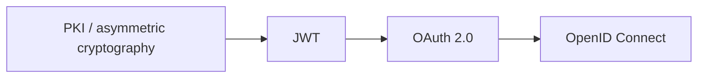

# Security Deep Dives

Security concepts explored from foundational cryptographic mechanisms to authentication and authorization protocols used by backend systems.

## Topics

| Number | Topic | Focus |
|---:|---|---|
| 001 | Encoding | Representation of data and why encoding is not encryption |
| 002 | Encryption | Confidentiality and cryptographic encryption |
| 003 | Hashing | One-way functions, integrity, and password-related concepts |
| 004 | PKI | Certificates, trust, public/private keys, and certificate authorities |
| 005 | mTLS | Mutual authentication using TLS certificates |
| 006 | [JWT](006-JWT.md) | Token format, claims, signatures, and validation |
| 007 | [OAuth 2.0 & OpenID Connect](007-OAuth2.md) | Authorization, identity, tokens, and OAuth flows |

## Learning path

The topics are intentionally related rather than isolated. PKI and asymmetric cryptography help explain JWT signatures. JWT is frequently used as an access token format, while OAuth 2.0 defines authorization flows and roles rather than a token format. OpenID Connect adds an identity layer on top of OAuth 2.0.

## Hands-on

The OAuth 2.0 deep dive is complemented by an executable .NET lab using a real Authorization Server in Docker. The lab focuses on Client Credentials, JWT validation, scopes, token reuse and safe renewal, with unit and integration tests covering the relevant authorization scenarios.
