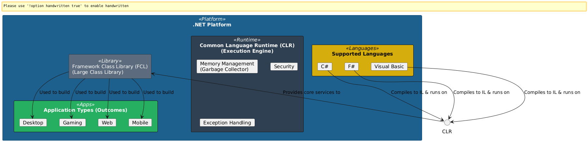

# 001 - What is .Net

## Question

What is .Net?

## Answer
.NET is a comprehensive development platform used for building a wide variety of applications, including web, mobile, desktop, and gaming. It supports multiple programming languages, such as C#, F#, and Visual Basic. .NET provides a large class library called Framework Class Library (FCL) and runs on a Common Language Runtime (CLR) which offers services like memory management, security, and exception handling.

