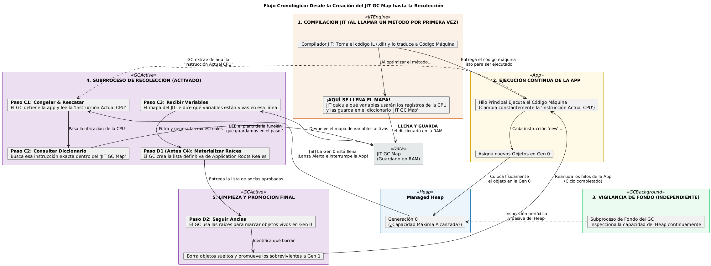

# 006 - How does garbage collection work in .NET?

## Question

How does garbage collection work in .NET?

## Answer

The .NET garbage collector automatically manages memory allocated for managed
objects.

When an object is no longer reachable from application roots, such as local
variables, static fields, or active references, its memory becomes eligible
for collection.

The managed heap is organized into generations:

- Generation 0 contains newly allocated and short-lived objects.
- Generation 1 acts as a transition between short-lived and long-lived objects.
- Generation 2 contains objects that have survived previous collections and
  are expected to live longer.

New objects are normally allocated in Generation 0. Objects that survive a
collection can be promoted to a higher generation.

Large objects are generally allocated in the Large Object Heap.

Garbage collection is automatic, but it does not replace deterministic
resource cleanup. Resources such as files, database connections, sockets, and
streams should normally be released through `IDisposable` and `using`.

Applications should generally not call `GC.Collect()` because the runtime is
better positioned to decide when a collection is necessary.



## Example

Source code:

[Q006GarbageCollection.cs](../../../src/Level1.BackendFoundations/Examples/Q006GarbageCollection.cs)

Run from the repository root:

```powershell
dotnet run --project src/Level1.BackendFoundations -- 006